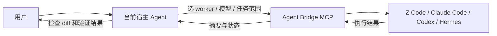
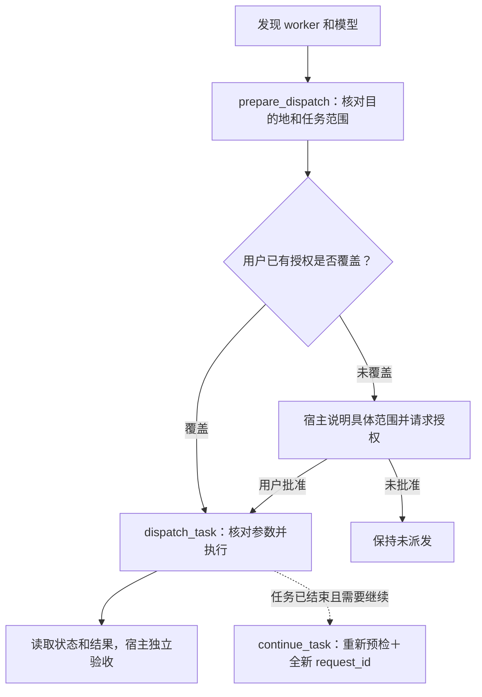

# Agent Bridge

当前版本：0.2.3。更新记录见 [CHANGELOG](CHANGELOG.md)。

Agent Bridge 是插件，包含 MCP 执行核心和 `dispatch` Skill。Skill 指导宿主如何派发与验收任务，MCP 负责实际执行。

由当前宿主 Agent 选择 worker、模型和推理强度，Bridge 执行任务，结果交回宿主验收。装在 Codex、Claude Code、Z Code 或 Hermes 中，就由对应的当前会话调度；仍可调用其他 worker。

## 核心实现



- 一套执行核心，多个宿主安装入口；小任务由宿主直接完成。
- 每次明确选择 worker、provider、model、effort，不自动换模型或继续嵌套委派。
- 宿主默认质量优先：选择已配置的首选完整模型，普通任务用支持的 `high`，复杂任务用最高支持的推理档；保留用户明确选择，不根据 worker 名字猜模型能力。
- 新任务通过 `task_contract` 明确背景、修改边界、集成责任和逐项验收标准。worker 返回后由宿主独立验证并用 `record_review` 保存证据；失败项可随显式续接交回返修。
- `prepare_dispatch` 从本地配置解析实际服务地址，绑定任务、宿主、运行时和声明的读取范围；有效期 30 分钟且只约束新的提交，不调用模型。
- `dispatch_task` 核对预检参数与当前目的地，再启动异步任务。同一项目串行执行，相同 `request_id` 和参数复用原任务。默认没有总时长上限；显式给出的正数时间预算会被执行且可超过一小时。
- `.ai/` 保存预检记录、任务、结果与周期性检查点，支持取消和已保存结果恢复；不要提交这些运行产物。
- 每个 worker 都持久化紧凑进度：阶段、最近活动、工具进度、阻塞和会话编号，并附带仅提示性的疑似停滞评估；静默不会被自动终止。

## 怎么使用

需要 Node.js 22+、POSIX 运行环境，以及至少一个已安装并配置模型服务的 worker。

```sh
git clone https://github.com/henryzhang-tn/agent-bridge.git
cd agent-bridge
node plugins/agent-bridge/scripts/bridge.mjs workers
```

| 宿主 | 接入方式 |
| --- | --- |
| Codex | 安装 [插件目录](plugins/agent-bridge/)，或使用下面的 MCP 命令 |
| Claude Code | 本地使用 `claude --plugin-dir ./plugins/agent-bridge`；市场安装见下方 |
| Z Code | 在插件市场添加本仓库，通过 `.claude-plugin/marketplace.json` 的目录安装；包内有 Z Code 专用清单 |
| Hermes | 运行 `node scripts/host-config.mjs hermes`，将输出合并到 Hermes 配置，保留已有 MCP 和 Skill 配置 |

Codex 只注册 MCP 的方式：

```sh
codex mcp add agent_bridge --env AGENT_BRIDGE_HOST=codex -- node "$(pwd)/plugins/agent-bridge/scripts/mcp-server.mjs"
```

这不会自动安装 Skill；让当前会话阅读 [dispatch Skill](plugins/agent-bridge/skills/dispatch/SKILL.md)。通过完整插件安装时无需重复注册 MCP。

Claude Code 市场安装：

```text
/plugin marketplace add henryzhang-tn/agent-bridge
/plugin install agent-bridge@agent-bridge
```

需要手动接入其他宿主时，`node scripts/host-config.mjs <host>` 可生成绝对路径配置。安装后重新加载宿主会话，检查 `list_workers` 返回的 `host`。

安装后，直接调用 Skill 并描述任务：

```text
$agent-bridge:dispatch -w=zcode -m=GLM-5.3 -e=high 只读分析当前项目
```

`-w` 指定 worker（`zcode / claude / codex / hermes`），`-m` 指定模型，`-e` 指定推理强度。参数可省略，也支持用中文逗号分隔；未指定的参数由宿主选择。Codex worker 复用其生效配置中的默认 provider 与既有登录，支持 ChatGPT 登录、API Key 和自定义 `base_url`；预检通过本地运行时确定实际服务地址。

加 `-f` 表示预授权本次任务：宿主预检并说明当前配置的模型服务地址、项目范围和模式后，直接派发，不再重复确认。授权仅限本次任务；服务地址或范围变化时重新核对，系统审批仍保留。仅重新预检（目的地与范围不变）不需要重新询问已足够的直接授权。

```text
$agent-bridge:dispatch -w=zcode -m=GLM-5.3 -e=high -f 只读分析当前项目
```

```text
$agent-bridge:dispatch -w=zcode 实现 <需求>，修改范围限定为 <目录>
```

宿主会发现可用 worker 和模型，预检实际服务地址及任务范围，核对授权后派发。可在同一会话中要求查看进度、读取结果或取消任务。



预检编号只绑定参数，不代表用户批准。已有明确授权可以复用；目的地或任务范围变化时重新核对。`plan` 不修改源码，但读取的内容仍可能发送到模型服务；声明的读取范围和工具限制不是操作系统沙箱，不能绕过宿主审批。

## 工具与 worker

| MCP 工具 | 用途 |
| --- | --- |
| `list_workers` / `list_models` | 发现运行时、模型与推理强度；模型查询可能访问服务目录，但不发送推理任务 |
| `prepare_dispatch` | 本地目的地与任务范围预检（30 分钟绑定，仅约束新提交） |
| `dispatch_task` | 授权后派发，返回 job；可选显式时间预算，缺省无总时长上限 |
| `task_status` / `task_result` | 读取本地状态、全 worker 进度与结果 |
| `record_review` | 宿主记录每项验收证据，区分通过、失败和未验证；不调用模型 |
| `continue_task` | 已结束任务的显式续接：重新预检、全新 request_id；原生续接或明确标记的检查点续接 |
| `cancel_task` / `recover_result` | 取消，或恢复已有结果（不重新推理，也不是续接） |

worker 复用各自的模型服务配置；可用执行器、模型和推理强度以发现结果为准。安装 worker 后，应先检查配置，再派发任务。

`ready_for_review` 表示 worker 已返回。只有 `quality.acceptanceStatus: accepted` 表示宿主已记录所有必要项通过；`changes_requested` 表示有失败项，`incomplete` 表示仍有未验证项。旧客户端未传任务标准时标记 `unstructured`，可以执行和读取，需带标准续接后才能记录验收。推理请求、传给运行时的参数、运行时确认和服务端确认分别见 `effortEvidence`，未确认值保持未知。

`orphaned` 时先取消存活的 worker，再检查部分修改；`interrupted` 可读取已有产物和检查点。取消不会回滚源码；`recover_result` 只读取已保存结果，不会恢复执行——需要继续时用 `continue_task`。

开发、CLI 和参数说明见 [核心实现](plugins/agent-bridge/README.md)。Token 统计仅供参考，以服务商账单或额度记录为准；货币类预算控制不被接受，唯一强制执行的预算是显式时间预算。

[MIT License](LICENSE)
